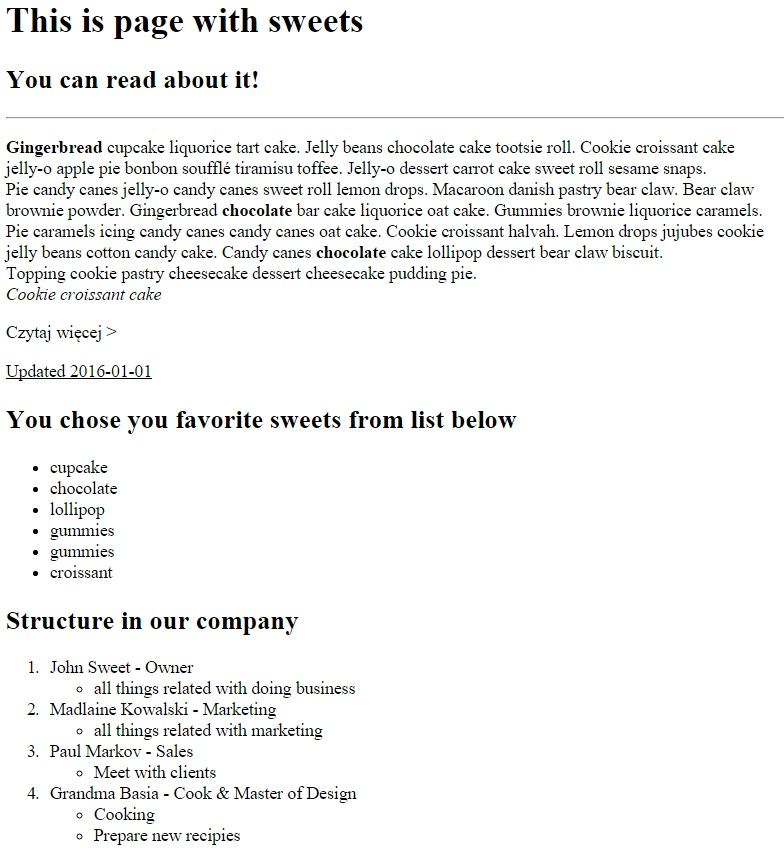

# HTML - Formatowanie tekstu

1. Na podstawie znanych elementów HTML, spróbuj stworzyć identyczną strukturę w index.html. Pamiętaj o odpowiednim zagnieżdżaniu elementów w liście ul. Jeśli nie pamiętasz jak zagnieżdżać elementy, wróć do slajdu "Zagnieżdżanie list" w prezentacji o HTML i CSS.

 

##Potrzebujesz pomocy?
*  [CupCake ipsum generator](http://www.cupcakeipsum.com/)
*  HTML i CSS - pre-work
