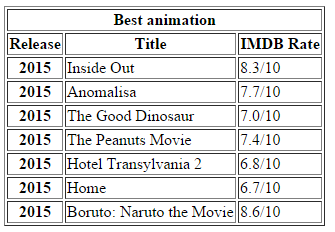

# HTML - Tabele

1. Stwórz w pliku index.html tabele. Wypełnij ją listą postaci z Twojego ulubionego serialu. Postaraj się, aby wyglądała tak jak poniżej.

 

2. Stwórz w pliku index.html tabele. Wypełnij ją listą najlepszych filmów jakie widziałeś w życiu. Postaraj się, aby wyglądała tak jak poniżej.

  

3. Stwórz w pliku index.html tabele. Postaraj się, aby wyglądała tak jak poniżej.

    

##Potrzebujesz pomocy lub inspiracji?
* [Poćwicz colspan i rowspan](https://jsfiddle.net/barney/ZBC6d/)
* [Wybierz inny serial :)](http://www.imdb.com/search/title?num_votes=5000,&sort=user_rating,desc&title_type=tv_series)
* HTML i CSS - pre-work
