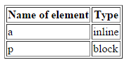

## Box model
1. Stwórz w pliku index.html link (odnośnik). Ustaw, dla niego następujące style (w pliku style.css):
  color: red;  border-color: red; width: 500px;  
  **Pamiętaj o dodaniu pliku style.css do index.html.** Co się stało? Czy Twój link ma 500px szerokości?  
Jakiego rodzaju elementem jest link  - inlinowy czy blokowy? Opisz swoje spostrzeżenia w komentarzu w pliku HTML.

2. W pliku index.html dodaj kolejny element - p. Ustaw takie same style dla niego. Co się dzieje tym razem? Opisz swoje spostrzeżenia w komentarzu w pliku HTML.

3. Sprawdź jakiego rodzaju  (inline czy block) są poniższe tagi:

    * h1, h2, h3
    * div
    * span
    * em, strong, u
    * ul and ol
    * table
    * img
    * iframe

Stwórz tabelkę i wypełnij ją według schematu poniżej:

 

## Potrzebujesz pomocy lub inspiracji?
* HTML i CSS - pre-work
