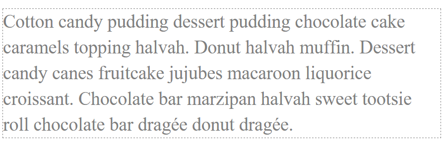

# HTML / CSS - ćwiczymy CSS

1. Stwórz 2 elementy div. Ustaw szerokość i wysokość dla każdego z nich w pliku style.css. Pamiętaj, aby ustawić im również obramowanie lub kolor tła jeśli chcesz je zobaczyć w przeglądarce.

2. Ustaw pierwszy div z poprzedniego zadania z lewej strony przeglądarki, a drugi z prawej.

3. Stwórz następne 2 elementy, tym razem p. Ustaw szerokość i wysokość dla każdego z nich oraz obramowanie. Wykorzystaj zdobytą wiedzę i ustaw je obok siebie (nie po przeciwnych stronach przeglądarki)

4. Dodaj style do paragrafu. Zobacz obrazek niżej:

    

## Potrzebujesz pomocy lub inspiracji?
* [Jeśli nie roumiesz czym jest tag div](http://www.html-5-tutorial.com/div-tag.htm)
* HTML i CSS - pre-work
