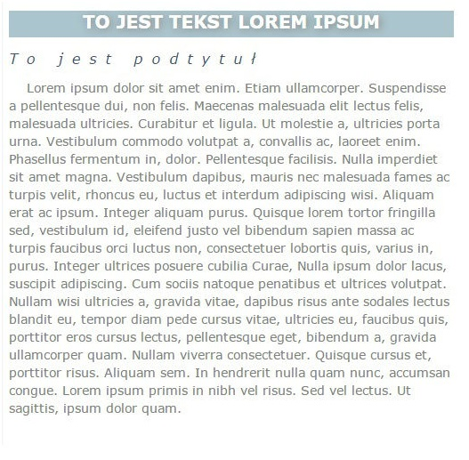

# CSS – Stylowanie tekstu

**Uwaga! Style pisz w pliku style.css, a nie inline. **

1. Stwórz element div, a w nim element h1, span oraz p. Ze strony [lipsum.pl](http://lipsum.pl/) ściągnij kawałek przykładowego tekstu i wstaw go do paragrafu. Uzupełnij również tekst w elemencie h1 oraz span. Następnie ostyluj element zgodnie z obrazkiem poniżej. **Postaraj się jak najlepiej odzwierciedlić przykład, zwracając uwagę na szczegóły. Nie wszystko jest opisane w specyfikacji poniżej.**

	Kilka pomocnych informacji:  
	* czcionka użyta w przykładzie -   Verdana, Arial, sans-serif;
	* szerokość elementu div -   500px;
	* h1 – kolor tła: #ACC4CE, kolor tekstu: white, wielkość czionki: 20px,  kolor cienia: #878787 (generator text-shadow:
	[lipsum.pl](http://www.cssportal.com/css3-text-shadow-generator/) )
	* span – kolor tekstu: #395075, odległość między literami: 10px
	* p – kolor tekstu: grey, wielkość czcionki: 14px; wysokość linii: 20px,  wcięcie: 20px;

	
